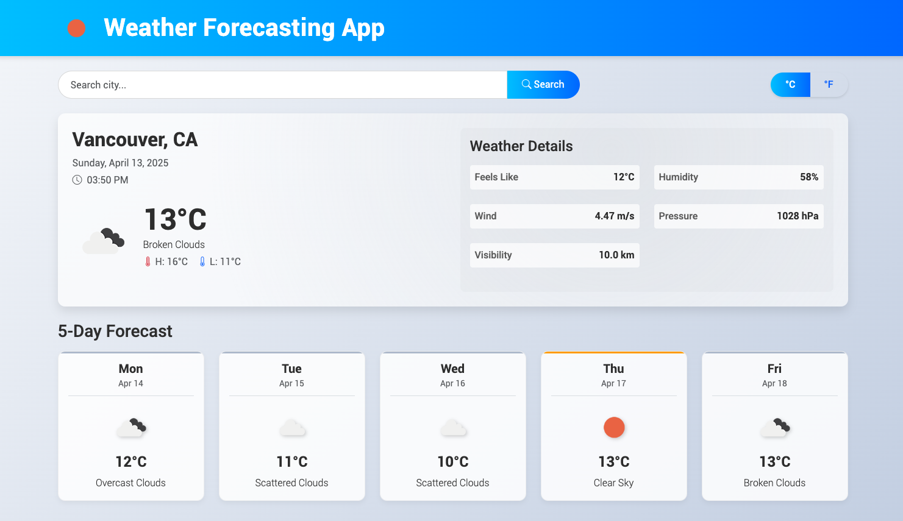

# Weather Forecasting App

A modern, responsive React application for checking weather forecasts using the OpenWeatherMap API.

<div align="center">
  
</div>

## 🌦️ Live Demo

Check out the live demo [here](https://weather-app-demo.netlify.app).

## Features

- Current weather conditions display
- 5-day weather forecast
- Search for any city globally
- Toggle between Celsius and Fahrenheit
- Responsive design that works on all device sizes
- Loading indicators and error handling
- Weather details including temperature, feels like, humidity, wind speed, pressure, and visibility

## Technologies Used

- **React**: Frontend UI library
- **Bootstrap**: CSS framework for responsive design
- **OpenWeatherMap API**: For weather data
- **Vite**: Build tool and development server

## Installation

1. Clone the repository:
   ```bash
   git clone https://github.com/yourusername/weather-app.git
   cd weather-app
   ```

2. Install dependencies:
   ```bash
   npm install
   ```

3. Create a `.env` file in the root directory and add your OpenWeatherMap API key:
   ```
   VITE_API_KEY=your_api_key_here
   ```
   Note: For this project, we're using the provided API key "52619a520cebfbf1411d80c82205fd69"

4. Start the development server:
   ```bash
   npm run dev
   ```

5. Open your browser and navigate to `http://localhost:5173`

## Project Structure

```
weather-app/
├── public/
├── src/
│   ├── assets/
│   ├── components/
│   │   ├── CurrentWeather.jsx
│   │   ├── ErrorAlert.jsx
│   │   ├── Footer.jsx
│   │   ├── ForecastItem.jsx
│   │   ├── ForecastList.jsx
│   │   ├── Header.jsx
│   │   ├── LoadingSpinner.jsx
│   │   ├── SearchBar.jsx
│   │   ├── UnitToggle.jsx
│   │   ├── WeatherDetails.jsx
│   │   └── WeatherIcon.jsx
│   ├── styles/
│   ├── utils/
│   │   └── weatherApi.js
│   ├── App.css
│   ├── App.jsx
│   ├── index.css
│   └── main.jsx
├── .env
├── index.html
├── package.json
├── README.md
└── vite.config.js
```

## API Usage

This app uses two main endpoints from the OpenWeatherMap API:

1. Current Weather: `https://api.openweathermap.org/data/2.5/weather`
2. 5-Day Forecast: `https://api.openweathermap.org/data/2.5/forecast`

## Building for Production

To build the app for production, run:

```bash
npm run build
```

This will create a `dist` folder with the production-ready files.

## Future Enhancements

- Add geolocation to automatically detect user's location
- Include more detailed hourly forecasts
- Add weather maps
- Implement dark/light theme toggle
- Add weather alerts and notifications

## License

This project is licensed under the MIT License - see the LICENSE file for details.